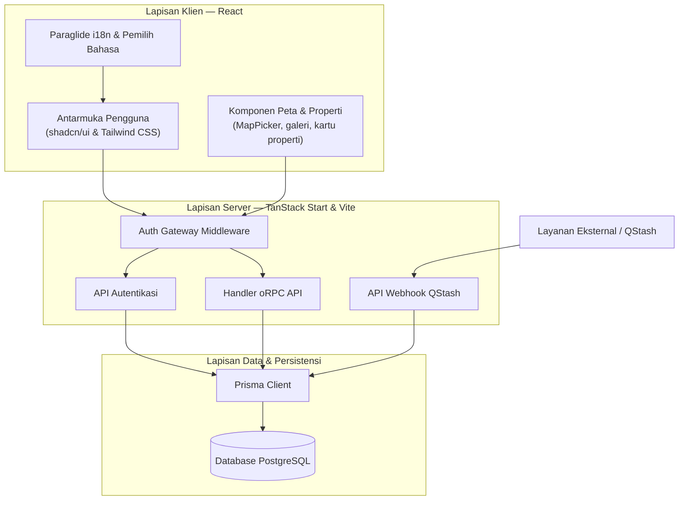
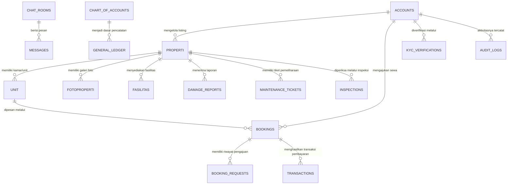

# PRD — Project Requirements Document

## 1. Overview

`konkosyuk-new` adalah aplikasi web full-stack untuk platform _listing_ properti dan kos serta manajemen sewa. Aplikasi ini ditujukan untuk menjawab masalah yang umum terjadi pada proses sewa menyewa kos/properti: informasi tempat tersebar dan sulit dibandingkan, proses pemesanan tidak transparan, pemilik kesulitan mengelola listing dan permintaan masuk, sementara pengelola platform membutuhkan pengawasan dan jejak data yang lengkap.

Tujuan utama aplikasi adalah menyatukan seluruh alur dalam satu sistem: calon penyewa dapat mencari dan melihat properti secara terbuka, penyewa terdaftar dapat mengajukan dan memantau booking, pemilik dapat mengelola properti dan mengevaluasi permintaan sewa, dan administrator dapat memantau operasional platform. Aplikasi juga mendukung administrasi lanjutan seperti verifikasi KYC, laporan kerusakan/pemeliharaan, inspeksi properti, pencatatan pembukuan, dan audit log.

Saat ini aplikasi sudah terbangun dan berjalan sebagai satu kesatuan sistem full-stack, bukan sekadar konsep atau rencana.

## 2. Requirements

- Platform harus menyediakan katalog properti/kos yang dapat dijelajahi oleh pengunjung tanpa harus login.
- Setiap properti harus menampilkan informasi pendukung, seperti galeri foto, fasilitas, unit/kamar yang tersedia, dan lokasi pada peta.
- Pengguna dapat membuat akun, masuk ke aplikasi, dan hanya dapat mengakses halaman sesuai perannya: Penyewa, Pemilik, atau Administrator.
- Penyewa terdaftar dapat mengajukan permintaan booking untuk sebuah unit dan melihat status pengajuannya.
- Pemilik properti harus memiliki dashboard untuk mengelola listing, meninjau permintaan sewa, memantau sewa aktif, dan melihat riwayat transaksi.
- Administrator harus dapat melihat ringkasan seluruh platform, memantau booking, mengelola pengguna dan konfigurasi, serta mengakses data verifikasi dan audit.
- Sistem perlu mencatat verifikasi KYC, laporan kerusakan, tiket pemeliharaan, inspeksi, dan audit log sebagai bagian administrasi operasional.
- Antarmuka harus mendukung peralihan bahasa (internasionalisasi) dan mode tampilan terang/gelap.
- Aplikasi harus menangani kondisi error dengan baik, seperti halaman tidak ditemukan, error saat render, dan akses ke halaman terproteksi tanpa izin.

## 3. Core Features

Fitur inti berikut selaras dengan roadmap dan sudah tersedia di dalam aplikasi.

### Fase 1

#### Jelajah Properti

- **Katalog Properti** — Menampilkan seluruh listing kos/properti dalam bentuk kartu informasi yang dapat dijelajahi pengunjung di halaman utama dan halaman katalog.
- **Penyaringan & Pencarian** — Calon penyewa dapat mempersempit daftar properti dengan pencarian berdasarkan kriteria tertentu.
- **Detail Properti** — Menampilkan informasi lengkap properti, termasuk galeri gambar, fasilitas, ketersediaan unit/kamar, dan lokasi melalui komponen peta.

#### Pengajuan Booking

- **Formulir Sewa** — Penyewa yang sudah masuk dapat mengisi formulir untuk mengajukan permintaan sewa sebuah unit melalui halaman booking baru.
- **Status Booking** — Penyewa dapat melihat daftar booking miliknya beserta status persetujuan dari pemilik.

#### Kelola Sewa Pemilik

- **Ringkasan Pemilik** — Pemilik mendapatkan dashboard yang menampilkan ringkasan properti dan kegiatan sewa.
- **Kelola Properti** — Pemilik dapat menambah, melihat, dan memperbarui listing properti beserta unitnya, termasuk menentukan lokasi melalui komponen peta.
- **Permintaan Sewa** — Pemilik meninjau daftar permintaan sewa masuk yang membutuhkan keputusan.
- **Sewa Aktif** — Pemilik dapat memantau unit yang sedang disewa beserta penyewanya.
- **Riwayat Transaksi** — Pemilik dapat melihat kembali riwayat transaksi sewa pada propertinya.

#### Administrasi Platform

- **Dashboard Admin** — Admin melihat ringkasan data dan mengakses menu administrasi platform.
- **Pantau Booking** — Admin dapat melihat seluruh booking yang terjadi di platform.
- **Kelola Pengguna** — Admin mengelola akun dan hak akses pengguna di platform.
- **Verifikasi & Audit** — Sistem menyediakan pencatatan untuk verifikasi dokumen, inspeksi, laporan pemeliharaan, dan jejak audit bagi kebutuhan admin.
- **Konfigurasi Platform** — Admin dapat mengubah konfigurasi dan pengaturan umum aplikasi.

#### Autentikasi Pengguna

- **Daftar Akun** — Pengunjung dapat membuat akun baru melalui halaman pendaftaran.
- **Masuk Akun** — Pengguna dapat masuk menggunakan kredensialnya untuk mengakses halaman yang dilindungi.
- **Peran & Proteksi** — Halaman penyewa, pemilik, dan admin hanya dapat diakses oleh pengguna dengan peran yang sesuai. Pengguna tanpa sesi akan diarahkan ke halaman masuk.

#### Lokalisasi & Tema

- **Pemilih Bahasa** — Antarmuka dapat dialihkan ke bahasa lain menggunakan pemilih bahasa.
- **Mode Terang/Gelap** — Pengguna dapat mengganti tampilan aplikasi antara mode terang dan gelap.

## 4. User Flow

### Calon penyewa / pengunjung

1. Pengunjung membuka halaman utama aplikasi.
2. Pengunjung menjelajahi katalog properti dan melihat daftar listing.
3. Pengunjung menyaring atau mencari properti sesuai kebutuhannya.
4. Pengunjung membuka halaman detail properti untuk melihat galeri, unit, fasilitas, dan lokasi peta.
5. Jika ingin mengajukan sewa dan belum login, pengunjung diarahkan ke halaman masuk atau daftar.

### Penyewa terdaftar

1. Penyewa masuk ke akun dan membuka halaman booking baru.
2. Penyewa mengisi formulir permintaan sewa untuk unit yang dipilih.
3. Pengajuan dikirim ke sistem dan muncul di daftar booking milik penyewa.
4. Penyewa dapat memantau status persetujuan booking.

### Pemilik properti

1. Pemilik masuk ke akun dan membuka dashboard pemilik.
2. Pemilik menambah atau memperbarui listing properti beserta unit-nya, termasuk menandai lokasi melalui peta.
3. Pemilik membuka menu permintaan sewa untuk meninjau permintaan masuk.
4. Pemilik memantau unit yang sedang disewa melalui menu sewa aktif.
5. Pemilik melihat riwayat transaksi sewa dari menu riwayat.

### Administrator

1. Admin masuk ke akun dan membuka dashboard admin.
2. Admin melihat ringkasan kondisi platform.
3. Admin memantau seluruh booking melalui menu pemantauan booking.
4. Admin menjalankan tugas administrasi, seperti mengelola pengguna, verifikasi/audit, dan mengubah konfigurasi platform.
5. Event dari layanan eksternal juga diterima sistem melalui API webhook untuk diproses secara asinkron.

## 5. Architecture

Aplikasi berjalan sebagai sistem full-stack dengan pembagian utama sebagai berikut:

- **Lapisan klien** terdiri dari antarmuka React yang dibangun dengan shadcn/ui dan Tailwind CSS. Modul peta dan komponen properti digunakan untuk menampilkan listing, galeri, dan lokasi.
- **Lapisan server** dibangun di atas TanStack Start dan Vite. Semua permintaan data dari antarmuka melewati middleware autentikasi (_auth gateway_) sebelum diteruskan ke handler oRPC. Input data divalidasi menggunakan skema Zod.
- **Endpoint autentikasi** dan **webhook** ditangani terpisah di tingkat server. Webhook menerima event asinkron dari layanan eksternal seperti QStash.
- **Lapisan data** memakai Prisma Client untuk menyimpan dan mengambil data dari database PostgreSQL.

Alur di atas menggambarkan arsitektur nyata aplikasi: antarmuka tidak mengakses database langsung, melainkan melalui lapisan server yang memvalidasi, memproteksi, dan memastikan data masuk hanya melalui jalur yang benar.

## 6. Database Schema

Skema database dikelola menggunakan Prisma ORM dengan database PostgreSQL. Lokasi definisi skema berada di `prisma/schema.prisma` dan migrasinya dikelola pada folder `prisma/migrations/`.

Dokumentasi yang tersedia tidak mengekspos daftar kolom dan tipe data secara detail. Karena itu bagian ini hanya mencantumkan entitas yang benar-benar disebut, beserta perannya masing-masing, tanpa mengarang kolom.

| Entitas                     | Peran dalam sistem                                                              |
| --------------------------- | ------------------------------------------------------------------------------- |
| `accounts`                  | Akun pengguna yang digunakan untuk autentikasi dan pembagian peran.             |
| `properti`                  | Listing properti atau kos yang dikelola oleh pemilik.                           |
| `unit`                      | Kamar/unit di dalam properti yang dapat disewa.                                 |
| `FotoProperti`              | Galeri foto yang menampilkan gambar properti.                                   |
| `Fasilitas`                 | Fasilitas yang tersedia pada properti/unit.                                     |
| `bookings`                  | Catatan pemesanan/sewa unit.                                                    |
| `booking_requests`          | Pengajuan permintaan booking yang perlu ditinjau.                               |
| Transaksi pembayaran        | Data transaksi pembayaran sewa; divalidasi melalui skema oRPC `transaction.ts`. |
| `general_ledger`            | Catatan pembukuan keuangan utama platform.                                      |
| `chart_of_accounts`         | Daftar akun yang menjadi referensi pembukuan.                                   |
| `kyc_verifications`         | Verifikasi dokumen pengguna untuk kepatuhan administratif.                      |
| `damage_reports`            | Laporan kerusakan dari penyewa atau pihak terkait.                              |
| `maintenance_tickets`       | Tiket pemeliharaan/perbaikan yang perlu ditindaklanjuti.                        |
| `inspections`               | Catatan inspeksi properti.                                                      |
| `audit_logs`                | Jejak audit aktivitas penting di sistem.                                        |
| `chat_rooms` dan `messages` | Data percakapan antar pengguna pada platform.                                   |

Berikut diagram ER konseptual untuk menggambarkan hubungan antar entitas utama:

Diagram di atas adalah relasi bisnis tingkat konseptual. Relasi fisik, foreign key, dan detail kolom aktual ditentukan oleh skema Prisma.

## 7. Tech Stack

Teknologi berikut sudah digunakan oleh aplikasi dan tidak memakai stack default tambahan:

- **Runtime & Package Manager** — Bun.
- **Web Framework** — TanStack Start dan Vite.
- **Bahasa Pemrograman** — TypeScript dengan mode strict.
- **Frontend** — React.
- **UI Components & Styling** — shadcn/ui, Tailwind CSS, dan pustaka komponen Radix UI.
- **Internasionalisasi** — Paraglide JS, dengan berkas pesan pada direktori `messages/` untuk berbagai bahasa seperti Indonesia, Inggris, Jerman, Mandarin, Korea, Vietnam, Thai, Filipina, dan Rusia.
- **API Layer** — oRPC dengan validasi skema Zod.
- **Database & ORM** — PostgreSQL dan Prisma ORM.
- **Autentikasi & Otorisasi** — Auth Gateway Middleware pada lapisan server untuk proteksi rute berbasis peran.
- **Proses Latar Belakang / Webhook** — Endpoint webhook QStash untuk menerima event asinkron dari layanan eksternal.
- **Kualitas Kode** — ESLint, Prettier, dan TypeScript path alias untuk kemudahan pengembangan.
